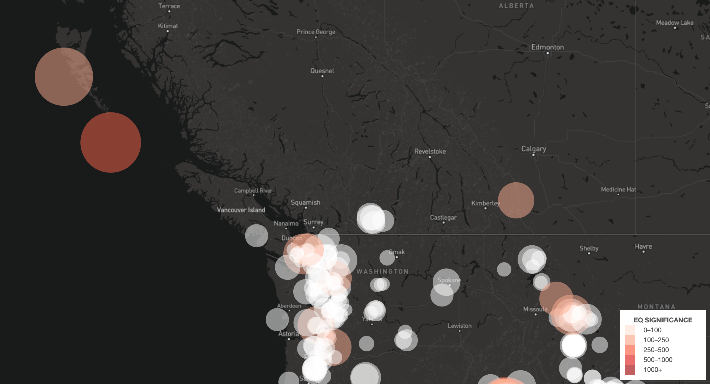
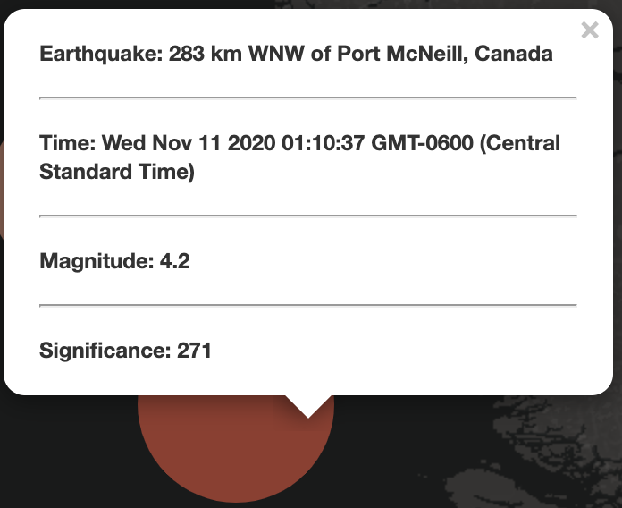
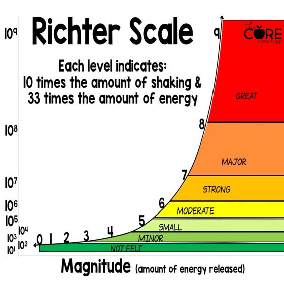
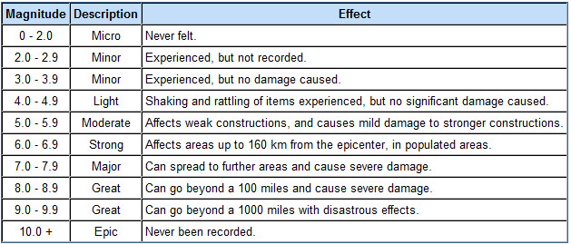

# USGS Earthquake Visualization

## Project Instructions

The primary objective of the assignment was to use publicly available USGS geoJSON data in order to visualize not only the location of the most recent (*within the last month*) earthquakes but also their magnitude and their significance.

The raw data used to generate the visualization can be found [here](https://earthquake.usgs.gov/earthquakes/feed/v1.0/summary/1.0_month.geojson)

One of the most interesting and challenging aspects of this assignment was its requirement to be dynamic. Creating the front end of any web application is one of the areas where a coder can show their more artistic side and put a bit of flair into the project/assignment that wasnt necessary, but adds to the overall presentation.

## Project Description

When the app is opened, you are greeted with a map of the United States and all of it's earthquakes over the previous month. The size of the marker is entirely dependent upon the magnitude of the earkquake, while the color indicates it's significance.

When one of the quake markers is clicked, a pop-up is displayed. Within this pop-up contains the earthquake position with respect to the nearest landmark, the time with respect to the user's local timezone, the magnitude as well as the significance. The magnitude and teh significane are numerically represented in this case, compared to the visual representation on the map itself.

The standard of earthquake intensity measurement is known as the Richter Scale. Developed in 1935 by Charles Richter, it is used to compare the size of the magnitude of earthquakes. Magnitudes of earthquakes are determined from the log of the amplitude of waves that are measured by one or more seismographs positioned around the globe!

## Demonstration

The deployed visualization can be found at <https://tward90.github.io/USGS_Earthquake_Visualization/>